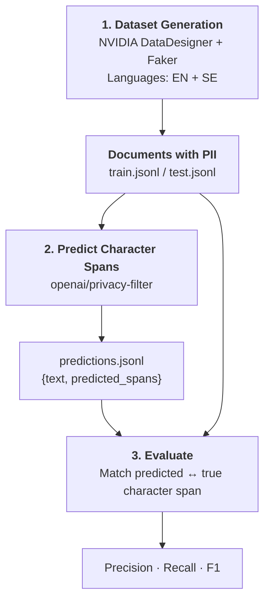

```mermaid
flowchart TD
    GEN["`**1. Dataset Generation**

NVIDIA DataDesigner + Faker
Languages: EN + SE`"]

    GEN --> DOCS["`**Documents with PII**

train.jsonl  /  test.jsonl`"]

    DOCS --> PRED["`**2. Predict Character Spans**
openai/privacy-filter`"]

    PRED --> POUT["`predictions.jsonl
{text, predicted_spans}`"]

    POUT --> EVAL["`**3. Evaluate**
    Match predicted ↔ true character span`"]
    DOCS --> EVAL

    EVAL --> METRICS["`Precision  ·  Recall  ·  F1`"]
```