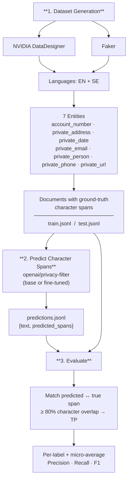

```mermaid
flowchart TD
    GEN["**1. Dataset Generation**"]

    GEN --> NV["NVIDIA DataDesigner"]
    GEN --> FK["Faker"]

    NV --> LANG["Languages: EN + SE"]
    FK --> LANG

    LANG --> ENT["7 Entities\naccount_number · private_address · private_date\nprivate_email · private_person · private_phone · private_url"]

    ENT --> DOCS["Documents with ground-truth\ncharacter spans\n─────────────────────\ntrain.jsonl  /  test.jsonl"]

    DOCS --> PRED["**2. Predict Character Spans**\nopenai/privacy-filter\n(base or fine-tuned)"]

    PRED --> POUT["predictions.jsonl\n{text, predicted_spans}"]

    POUT --> EVAL["**3. Evaluate**"]
    DOCS --> EVAL

    EVAL --> MATCH["Match predicted ↔ true span\n≥ 80% character overlap → TP"]

    MATCH --> METRICS["Per-label + micro-average\nPrecision · Recall · F1"]
```
