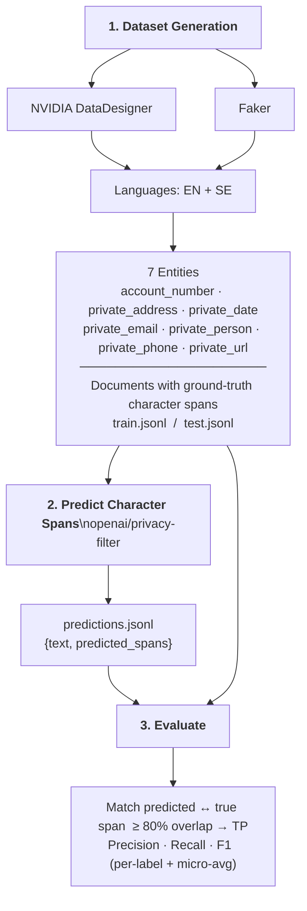

```mermaid
flowchart TD
    GEN["`**1. Dataset Generation**`"]

    GEN --> NV["NVIDIA DataDesigner"]
    GEN --> FK["Faker"]

    NV --> LANG["Languages: EN + SE"]
    FK --> LANG

    LANG --> DOCS["7 Entities\naccount_number · private_address · private_date\nprivate_email · private_person · private_phone · private_url\n─────────────────────\nDocuments with ground-truth character spans\ntrain.jsonl  /  test.jsonl"]

    DOCS --> PRED["`**2. Predict Character Spans**\nopenai/privacy-filter`"]

    PRED --> POUT["predictions.jsonl\n{text, predicted_spans}"]

    POUT --> EVAL["`**3. Evaluate**`"]
    DOCS --> EVAL

    EVAL --> METRICS["Match predicted ↔ true span  ≥ 80% overlap → TP\nPrecision · Recall · F1  (per-label + micro-avg)"]
```
