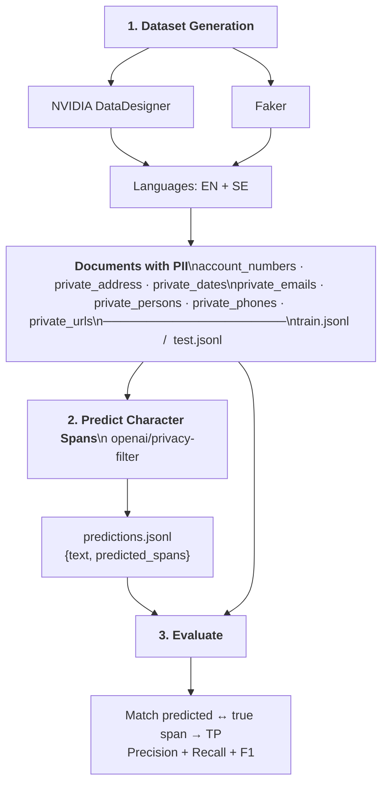

```mermaid
flowchart TD
    GEN["`**1. Dataset Generation**`"]

    GEN --> NV["NVIDIA DataDesigner"]
    GEN --> FK["Faker"]

    NV --> LANG["Languages: EN + SE"]
    FK --> LANG

    LANG --> DOCS["`**Documents with PII**\naccount_numbers · private_address · private_dates\nprivate_emails · private_persons · private_phones · private_urls\n─────────────────────\ntrain.jsonl  /  test.jsonl`"]

    DOCS --> PRED["`**2. Predict Character Spans**\n openai/privacy-filter`"]

    PRED --> POUT["predictions.jsonl\n{text, predicted_spans}"]

    POUT --> EVAL["`**3. Evaluate**`"]
    DOCS --> EVAL

    EVAL --> METRICS["Match predicted ↔ true span → TP\nPrecision + Recall + F1"]
```
